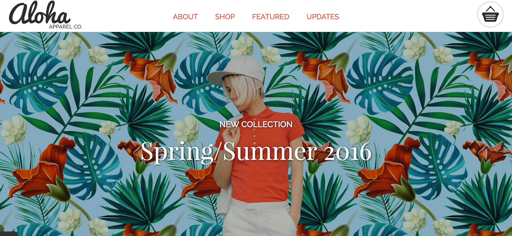

##Project 1: Aloha Apparel Co.

This is a thoughtful write-up about my project...

## Description
- Create a one-page, responsive website that allows a user to find a path they need easily
- Optimize for 3 widths: mobile, min-width: 600px, and min-width: 1240px.

##Technologies Used:

- Google Chrome (https://www.google.com/chrome/)
- Google Chrome Developer Tools
- Flickity (http://flickity.metafizzy.co/)
- Font Awesome (http://fontawesome.io/)
- Font Squirrel (https://www.fontsquirrel.com/)
- Eye Dropper (Google Chrome extension)
- W3C HTML Validator (https://validator.w3.org/nu/#file)
- W3C Validation service (https://jigsaw.w3.org/css-validator/#validate_by_upload)
- JQuery (https://jquery.com/)
- Git

## Personal Learnings:
This project allowed me to utilize HTML, CSS and JavaScript to develop a website and 
expand my knowledge in the following ways:

- The process of refactoring  my code to build a responsive website helped me understand the different properties one has to consider when using a mobile-first approach.

- The value of div tools can be very helpful in identifying underlying issues in code or assist in making a website consistent across many browsers. 

- My understanding of areas such as flexbox and JQuery are improving as I practice and test more often.

